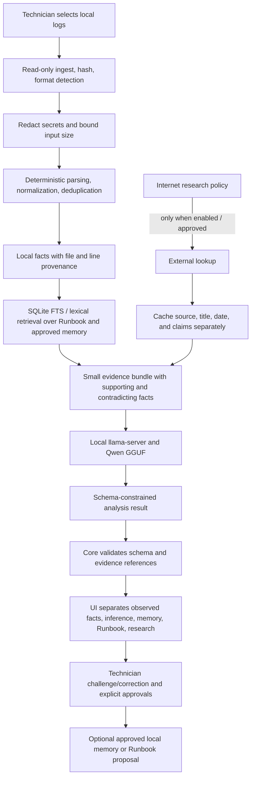

# DivaByte Local LLM Recommendation

Research snapshot: 2026-10-01. This is a deployment recommendation, not a claim that a model is already integrated or validated on Field Kit logs.

## Decision

- **Runtime:** `llama.cpp` `llama-server`, built as a small CPU-capable native executable for each supported operating system. Bind only to loopback and call its OpenAI-compatible chat endpoint from the shared Rust core.
- **Model:** `Qwen3-4B-Instruct-2507` in GGUF `Q4_K_M` format: `Qwen3-4B-Instruct-2507-Q4_K_M.gguf`, approximately 2.50 GB. The current quantized artifact is published at [bartowski/Qwen_Qwen3-4B-Instruct-2507-GGUF](https://huggingface.co/bartowski/Qwen_Qwen3-4B-Instruct-2507-GGUF); its model card points to the upstream [Qwen model](https://huggingface.co/Qwen/Qwen3-4B-Instruct-2507). The upstream model is Apache-2.0 licensed. Verify the quantization repository's license, record the exact file SHA-256, and package the license before redistribution.
- **MCP:** No MCP server in the first release. The existing versioned loopback DivaByte API already connects the Field Kit clients to one core. Add an optional MCP adapter only if a later release needs third-party MCP clients; do not let the model gain direct file, shell, or repair access.
- **Research policy:** Local inference and local evidence are the default. `Offline` makes no network request. `Ask Before Researching` requires a separate user approval for each request. `Local + Research` permits an explicitly selected research session. Cache URL, title, retrieval time, and cited claims separately from current evidence; never upload raw logs to a research service.

Qwen3-4B-Instruct-2507 is the non-thinking, instruction-tuned Qwen3 update. The GGUF page lists its Q4_K_M artifact at 2.50 GB. Its 256K advertised context is not a sensible Field Kit default: set a 4K context for the first CPU benchmark and test 8K only when the memory preflight allows it. Model-benchmark results are not proof of log-root-cause accuracy; evaluate against Field Kit fixtures before making diagnostic claims.

`llama.cpp` is the runtime, not a model. The repository currently names `llama-server` but does not bundle that executable or any model weights. The existing deterministic Rust analysis is not LLM inference.

## Constraints And Storage

The local inventory identifies a Dell Precision 5680, Intel Core i7-13700H, 15.62 GiB RAM, and Intel Iris Xe integrated graphics. The live Windows inventory reported about 2.82 GiB free RAM at measurement time; the graphics adapter exposes shared memory, not a discrete GPU with dedicated VRAM. CPU inference is the portable baseline. Close memory-heavy applications and require a runtime free-memory check; benchmark before enabling the model by default.

The tracked Field Kit source measures 27,327,508 bytes (27.3 MB). A marketed 16 GB drive represents about 14.9 GiB before filesystem overhead. This proposed budget uses decimal GB consistently:

| Allocation | Budget | Basis |
| --- | ---: | --- |
| Qwen3-4B-Instruct-2507 Q4_K_M | 2.50 GB | Published GGUF artifact size |
| Tracked Field Kit package | 0.03 GB | Measured repository files |
| App binaries and all CPU runtime builds | 0.75 GB | Conservative package ceiling; must be measured in release CI |
| Local cases, memory, FTS index, and research cache | 0.50 GB | Enforced data cap |
| Diagnostic reports and imported evidence | 8.00 GB | Retention cap; large dumps should remain external |
| Temporary/update staging | 1.00 GB | Working space |
| **Planned total / headroom on 16 GB** | **12.78 GB / 3.22 GB** | Before filesystem overhead |

This is a credible 16 GB storage plan, subject to a release-package size assertion and retention enforcement. It is separate from system RAM. For Qwen3-4B's 36-layer, 8-KV-head architecture, an FP16 KV cache is approximately:

$$36 \times 8 \times 128 \times 2_{K,V} \times 2\text{ bytes} \times 4096 \approx 576\text{ MiB}$$

At 8K context the same cache is about 1.125 GiB. Adding 2.33 GiB of quantized weights, the 4K KV cache, and runtime/compute buffers exceeds the Dell's currently observed 2.82 GiB free RAM. Therefore this machine needs a clean-session memory test; storage fit alone does not mean inference will be smooth. No token-per-second promise is made before benchmarking.

## Runtime Comparison

| Candidate | Decision | Reason for this deployment |
| --- | --- | --- |
| llama.cpp / llama-server | **Select** | GGUF quantization, CPU execution, Windows/macOS builds, small native runtime, loopback OpenAI-compatible API, and JSON-schema-constrained outputs. |
| Ollama | Do not ship as the product runtime | Excellent for developer testing and model management, but its service/cache lifecycle is less aligned with a self-contained field-kit directory. It uses llama.cpp underneath, so use llama.cpp directly for the portable package. |
| vLLM | Do not ship | Strong high-throughput serving, batching, and GPU support, but its serving/PyTorch environment is excessive for one technician and a 16 GB USB package. |

MLX is Apple-Silicon-specific and cannot serve as the shared runtime. Intel IPEX-LLM is excluded because Intel archived it on 2026-01-28 and its repository warns that it has known security issues and is no longer maintained. `llama.cpp` supports multiple backends, but the release baseline should be a CPU build; optional hardware-specific packages can follow measured demand.

## Log Analysis Pipeline

Keep parsing deterministic where possible. Use parsers for JSON/CSV/EVTX exports and stable templates first; deduplicate repeated events and correlate timestamps; redact passwords, tokens, keys, and recovery secrets; then send a bounded set of relevant facts to the model. Use local FTS/BM25 over Runbook and prior approved memory before introducing vector embeddings or another model. The LLM should explain and rank hypotheses, cite existing evidence IDs, expose contradictions/unknowns, and suggest read-only next diagnostics. Validate every output against the existing analysis schema. Never execute a repair from model output.

The model receives no arbitrary tool list. The Rust core retains all file and process permissions. Future Internet research must be separately labeled and source-cited; raw evidence remains local unless the technician explicitly approves a narrowly scoped share.

## Research Review

- [Build Your Own X](https://github.com/codecrafters-io/build-your-own-x) is a tutorial index, including LLM- and RAG-from-scratch learning material. Those are useful for concepts, not a reason to hand-roll production inference.
- [Awesome-LLM](https://github.com/Hannibal046/Awesome-LLM) lists inference projects including llama.cpp, Ollama, and vLLM, but its README is roughly a year behind the current runtime releases. Use it as discovery, not as the current benchmark source.
- [Awesome Log Analysis](https://github.com/logpai/awesome-log-analysis) is a research/paper/dataset index, but its last README update is about four years old. Its topic taxonomy remains useful; it is not a 2026 implementation recommendation.
- [Awesome Python Applications](https://github.com/mahmoud/awesome-python-applications) is a case-study list of shipped Python apps, not a compact LLM or model benchmark. Python is not required in DivaByte's Rust core.
- The GitHub `awesome-devops` topic is a tag page, not a single authoritative curated list. [DevOps Exercises](https://github.com/bregman-arie/devops-exercises) is useful for operations study, not inference-runtime evidence.
- [Awesome Selfhosted](https://github.com/awesome-selfhosted/awesome-selfhosted) is an actively updated application directory and lists Ollama/LocalAI among self-hosted AI software. These are product discovery examples, not proof they fit a 16 GB removable package.
- [Public APIs](https://github.com/public-apis/public-apis) now has an MCP category, but its central catalog is network APIs. Those entries do not satisfy offline-first log analysis.
- [Free Programming Books](https://github.com/EbookFoundation/free-programming-books) is a learning-resource index, not current empirical research or a deployment benchmark.

The prompt's named research papers mostly concern **log template parsing**, not root-cause reasoning. [LILAC](https://arxiv.org/abs/2310.01796) uses an adaptive cache to reduce repeated LLM parser calls; [LEMUR](https://arxiv.org/abs/2402.18205) uses entropy sampling and template merging; [LogParser-LLM](https://arxiv.org/abs/2408.13727) studies LLM-based template extraction. [LogEval](https://arxiv.org/abs/2407.01896) is more relevant to diagnosis/summarization evaluation and explicitly measures multiple log-analysis tasks. The 2025 [systematic review](https://arxiv.org/abs/2504.04877) covers 29 parsing methods and reports reproducibility/comparability problems. The newer 2026 [LLM4Log review](https://arxiv.org/abs/2604.16359) surveys 145 papers and highlights grounding, drift, context limits, latency, privacy, and hallucination risks. The 2026 [CelerLog](https://arxiv.org/abs/2605.26005) and [EFParser / Small is Beautiful](https://arxiv.org/abs/2601.22590) papers support a hybrid design: route repeated/common patterns through deterministic processing and use model calls selectively, then validate/cache results. These are author-reported research results on their datasets, not a guarantee for Field Kit incidents.

The prompt's exact `DivLog` citation could not be verified in targeted arXiv searches; a similar search surfaced a different paper, *Prompting for Automatic Log Template Extraction*. Do not cite “DivLog” until a DOI, title, or author is supplied.

The [MCP specification](https://modelcontextprotocol.io/specification/2025-11-25) standardizes resource, prompt, and tool exchange, but emphasizes consent because tools can execute arbitrary code. DivaByte already has a versioned local core API and one first-party client; MCP would add a server/process and authorization surface without solving a current integration need. Keep MCP **off** in v1.

## Eight-Week Roadmap

1. **Week 1 - Freeze the portable target:** pin llama.cpp version/build flags, model revision, quantization, license and SHA-256; measure exact package size; benchmark cold-start, prompt processing, generation speed, peak RAM, and thermals on the Dell with a 4K context. Fail gracefully if free RAM is below the measured minimum.
2. **Week 2 - Shared inference adapter:** launch/stop llama-server from the Rust core, bind to `127.0.0.1`, use a random session credential, disable runtime downloads, expose provider/model status, and test health, cancellation, timeout, malformed JSON, and offline mode.
3. **Week 3 - Evidence pipeline:** structured log parsers, time normalization, stable IDs, SHA-256 provenance, size bounds, and secret redaction; fixtures for Windows events, application logs, and network logs.
4. **Week 4 - Retrieval and cache:** local lexical/FTS retrieval for Runbook and technician-approved memory; repeated-template cache; keep current-event evidence distinct from historic memory.
5. **Week 5 - Grounded reasoning:** use the existing schema and llama.cpp JSON-schema output; validate every evidence reference; require support, contradiction, unknowns, confidence, and next read-only diagnostic; test technician corrections.
6. **Week 6 - UI integration:** surface model health, memory preflight, progress/cancel, citations, and uncertainty; explicit approval for research and any Runbook change; no model-triggered repair calls.
7. **Week 7 - Portability:** produce CPU runtimes for Windows x64, macOS Intel, and macOS Apple Silicon; run the same fixtures across builds; package on an exFAT 16 GB drive; assert the 0.75 GB runtime/app allocation and 16 GB total budget in CI.
8. **Week 8 - Acceptance:** compare deterministic-only vs. model-assisted results on LogEval-style public fixtures and a technician-approved private fixture set; test network-disabled operation, USB vs. SSD loading, app startup/shutdown, memory pressure, and source/license/hash manifests. No release claim until the actual runtime and model tests pass.

## Research Sources

- Runtime: [llama.cpp](https://github.com/ggml-org/llama.cpp), [server API/build documentation](https://github.com/ggml-org/llama.cpp/blob/master/tools/server/README.md), [Ollama](https://github.com/ollama/ollama), [vLLM](https://docs.vllm.ai/en/latest/), [MLX](https://github.com/ml-explore/mlx), [archived IPEX-LLM](https://github.com/intel/ipex-llm).
- Model: [Qwen3-4B-Instruct-2507](https://huggingface.co/Qwen/Qwen3-4B-Instruct-2507), [Q4_K_M GGUF file and size](https://huggingface.co/bartowski/Qwen_Qwen3-4B-Instruct-2507-GGUF), [Qwen3 technical report](https://arxiv.org/abs/2505.09388).
- Protocol: [MCP 2025-11-25 specification](https://modelcontextprotocol.io/specification/2025-11-25).